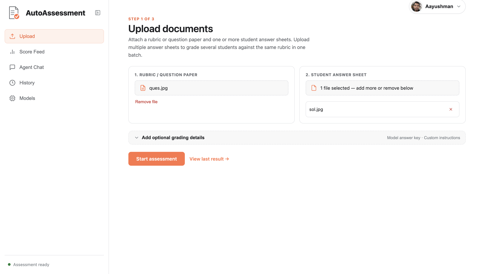
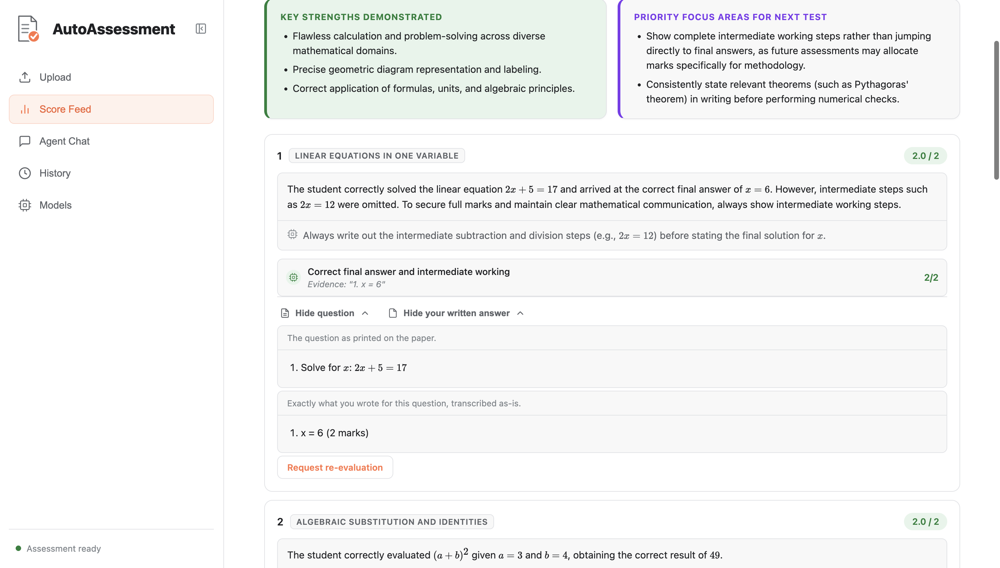
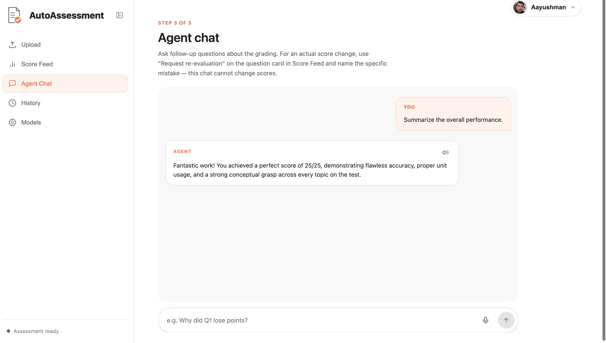

# Auto-Assessment Agent

A multi-agent grading system that evaluates handwritten and typed student answer sheets against a question paper, rubric, and (optional) model answer — evidence-anchored, criterion-level, with deterministic score auditing.

Handles PDFs, images, plain text, and DOCX. Grades one submission or a whole batch against the same rubric.

<video src="https://github.com/user-attachments/assets/8414c893-983e-415e-8052-bd8e116cb301" controls width="100%"></video>


---

## How it works

```text
Question Paper/Rubric ──▶ Transcriber ──▶ Solver (skipped if a model answer was provided)
                                                │
Student Submission ──▶ Transcriber ──▶ Evaluator ──▶ Auditor ──▶ Structured Assessment
                         (+ original pages, for diagram/sketch questions)   │
                                                                   ┌────────┼────────┐
                                                                Regrade  Agent Chat  History
```

| Stage | Role | Runs on |
|---|---|---|
| **Transcriber** | Reads handwritten/scanned PDFs and images into structured text, preserving notation, tables, and page layout | Gemini (vision) |
| **Solver** | Generates a reference solution when no official model answer is supplied | Gemini |
| **Evaluator** | Grades criterion-by-criterion with verbatim evidence quotes; for questions asking for a diagram/sketch/construction, also looks at the original pages directly instead of trusting the transcript alone | Gemini |
| **Auditor** | Checks score bounds and criterion-total arithmetic — no LLM call | Python |
| **Regrade Agent** | Re-checks a specific disputed criterion against the stored evidence before changing a score | Gemini |
| **Chat Agent** | Answers follow-up questions grounded in the saved assessment; favors Socratic guidance over just handing over answers, and stays concise | Gemini |

Model names default to `gemini-3.5-flash-lite` and are overridable via env vars (below). The live configuration is always available at `GET /api/models` — the frontend's **Models** page reads it directly rather than hard-coding it.

### Agentic memory

The Evaluator isn't stateless across runs — two lightweight memory stores feed back into every grading call:

- **Per-student weak-area memory** — after each assessment, recurring weak concepts are tracked per signed-in student (strengthens on repeat misses, fades once mastered) and fed back into the next grading pass, so feedback can say a mistake *persisted* or *improved* rather than repeating the same generic tip.
- **Cross-submission grading corrections** — when a "Request re-evaluation" confirms a genuine grading mistake, that correction is remembered against the exact question paper, so the next student graded on the same test doesn't get the same mistake repeated.

Identity for this is the signed-in Google account (proven via a server-issued, HMAC-signed session token — not a self-reported header), not the anonymous per-browser ID used for cosmetic session state.

---

## Quick start

### Prerequisites

- **Python 3.10+** (the Docker image uses 3.11)
- **Node.js 18+** and npm, for the frontend
- **Poppler**, which converts PDF pages to images for OCR. Without it, PDF uploads fail; image, text, and DOCX uploads still work.

```bash
brew install poppler               # macOS
sudo apt-get install poppler-utils # Debian/Ubuntu
```

On Windows, install a Poppler build and add its `bin` folder to `PATH`. Once the backend is running, `GET /api/system/check` reports whether Poppler was found.

### Install

```bash
git clone https://github.com/asu2304/auto-assessment-agent.git
cd auto-assessment-agent

python3 -m venv .venv
source .venv/bin/activate          # .venv\Scripts\activate on Windows
pip install -r requirements.txt
```

### Configure

Copy the template and fill in your keys:

```bash
cp .env.example .env
```

- **Gemini key** — create one at [Google AI Studio](https://aistudio.google.com/apikey) and set `GEMINI_API_KEY`.
- **Google sign-in** — in the [Google Cloud Console](https://console.cloud.google.com/apis/credentials), create an **OAuth client ID** of type **Web application**. Under **Authorized JavaScript origins** add `http://localhost` and `http://localhost:5173` (plus `http://localhost:8080` if you use Docker). Set the client ID as `GOOGLE_CLIENT_ID`. No client secret is needed.
- **Session secret** — generate one with `python3 -c "import secrets; print(secrets.token_hex(32))"` and set `SESSION_SECRET`.

| Variable | Required | Purpose |
|---|---|---|
| `GEMINI_API_KEY` | yes | transcription, grading, and chat |
| `GOOGLE_CLIENT_ID` | yes | Google sign-in |
| `SESSION_SECRET` | recommended | signs session tokens; if unset, a random one is generated per process start and everyone is signed out on restart |
| `GOOGLE_ALLOWED_DOMAINS` | no | comma-separated email domains allowed to sign in; unset = allow all |
| `AUTH_COOKIE_SECURE` | no | set to `true` when serving over HTTPS so the session cookie is HTTPS-only |
| `BODHAN_API_KEY` | for voice | enables `indic-speak` text-to-speech in Agent Chat through Bodhan; everything else works without it |
| `BODHAN_TTS_BASE_URL` | no | Bodhan OpenAI-compatible TTS base URL (default `https://api.bodhan.ai/v1`) |
| `TTS_MODEL` | no | text-to-speech model name (default `indic-speak`) |
| `USE_BODHAN_OCR` | no | set to `true` only if you have a separate OCR-capable Bodhan key; otherwise Gemini vision OCR is used |
| `BODHAN_OCR_API_KEY` | no | Bodhan OCR key used only when `USE_BODHAN_OCR=true` |
| `BODHAN_OCR_MODEL` | no | override the Bodhan OCR model when `USE_BODHAN_OCR=true` (default `indic-ocr`) |
| `GEMINI_TRANSCRIPTION_MODEL` / `GEMINI_GRADING_MODEL` / `GEMINI_CHAT_MODEL` | no | override the default model per stage |
| `PDF_OCR_DPI` | no | resolution used when converting PDF pages to images (default `200`) |
| `DB_PATH` | no | where the SQLite history database is stored (default: next to `web.py`; `/data/assessment_history.db` in Docker) |
| `BATCH_CONCURRENCY` | no | concurrent Gemini calls in a batch grading run (default `3`) |
| `MAX_BATCH_SIZE` | no | max students per batch (default `25`) |
| `MAX_IMAGES_PER_REQUEST` | no | max image/PDF pages per single upload (default `10`; PDFs are converted to page images for OCR) |

### Run

The quickest way is the launcher script, which loads `.env`, installs frontend dependencies on first run, and starts both servers:

```bash
./start.sh
```

Or run the two servers yourself (two terminals, with the virtual environment active for the backend):

```bash
# backend
cd auto_assessment/auto_assessment
uvicorn web:app --host 0.0.0.0 --port 8000 --reload

# frontend
cd auto_assessment/frontend
npm install && npm run dev
```

Frontend: `http://localhost:5173` (proxies `/api` and `/ws` to the backend) · Backend docs: `http://127.0.0.1:8000/docs`

### Tests

```bash
python -m unittest discover -s tests -v
```

The tests cover document parsing, report validation, and the config endpoints. They make no model calls, so no API keys are needed.

### Docker

```bash
docker compose up -d --build
```

Frontend: `http://localhost:8080` (nginx, proxies `/api` and `/ws` to the backend container) · Backend directly: `http://localhost:8001`. SQLite data persists in a named volume (`db_data`) across rebuilds. Requires `.env` in the repo root (same variables as above) — `docker-compose.yml` loads it via `env_file`.

---

## Using the app

- **Upload** — attach a rubric/question paper and one or more answer sheets (multiple files = batch grading); optionally attach a model answer and custom grading instructions.
- **Score Feed** — per-question score, evidence-anchored feedback, "View question" / "View your written answer" per question, and **Request re-evaluation** for disputed grading.
- **Agent Chat** — ask about the grading; concise, Socratic-leaning explanations grounded in the actual assessment. Can't change scores — use Request re-evaluation for that.
- **History** — reopen or delete past assessments without re-uploading. The 5 most recent assessment *runs* are kept per login (a batch counts as one run, not one per student).
- **Models** — live view of which model powers each pipeline stage.

| Upload | Score Feed | Agent Chat |
|---|---|---|
|  |  |  |

---

## API

| Endpoint | Purpose |
|---|---|
| `GET /api/models` | active model configuration |
| `POST /api/assess` | grade one submission |
| `POST /api/assess/batch` | grade multiple submissions against one shared rubric |
| `GET /api/assessments/recent` | list recent assessments (current session) |
| `GET /api/assessments/{id}` | fetch one assessment |
| `DELETE /api/assessments/{id}` | delete one assessment |
| `POST /api/regrade` | request re-evaluation of a specific question |
| `POST /api/chat` | assessment-grounded chat |
| `POST /api/voice/synthesize` | text-to-speech for chat/feedback (requires `BODHAN_API_KEY`) |
| `GET /api/system/check` | reports whether Poppler and the Bodhan key are available |

Replace the file paths with your own rubric and answer sheet:

```bash
curl -X POST "http://127.0.0.1:8000/api/assess" \
  -F "rubric_file=@path/to/rubric.pdf" \
  -F "answer_file=@path/to/student_answer.pdf"
```

```bash
curl -X POST "http://127.0.0.1:8000/api/regrade" \
  -H "Content-Type: application/json" \
  -d '{
    "assessment_id": "YOUR_ASSESSMENT_UUID",
    "question_id": "Question 1",
    "claimed_mistake": "You said I did not show 2x = 12, but it appears in my solution.",
    "evidence_quote": "2x = 12"
  }'
```

---

## Design principles

1. **Evidence before assertion** — every grading decision cites the student's actual work (and, for diagrams, the actual page image).
2. **Separate responsibilities** — transcription, solving, evaluation, auditing, regrading, and chat are distinct steps with their own contracts.
3. **Deterministic where possible** — score arithmetic is checked in Python, not by another LLM call.
4. **Explicit uncertainty** — illegible or ambiguous work sets `needs_human_review`, rather than guessing.
5. **Actionable feedback** — every question gets a concrete "what to do differently next time," not just right/wrong.

---

## Repository structure

```text
auto-assessment-agent/
├── auto_assessment/
│   ├── auto_assessment/
│   │   ├── agent.py            # multi-agent pipeline + Pydantic contracts
│   │   ├── web.py              # FastAPI backend + persistence
│   │   └── document_parser.py  # PDF/image/text/DOCX parsing
│   └── frontend/
│       ├── src/App.jsx
│       ├── src/styles.css
│       ├── package.json
│       ├── Dockerfile          # build → nginx static + /api, /ws proxy
│       └── nginx.conf
├── tests/test_core.py          # unit tests (no API keys needed)
├── images/                     # README screenshots
├── requirements.txt
├── .env.example                # template for .env
├── Dockerfile                  # backend image (includes Poppler)
├── docker-compose.yml
├── start.sh                    # launches backend + frontend together
└── LICENSE
```

SQLite databases, `.venv`, `node_modules`, and build output are not committed.

---

## Tech stack

**Backend:** Python, FastAPI, Pydantic, Google Gen AI SDK, OpenAI SDK (Bodhan TTS), SQLite, Pillow
**Frontend:** React, Vite, react-markdown + KaTeX (math rendering)

## License

See [LICENSE](LICENSE).
